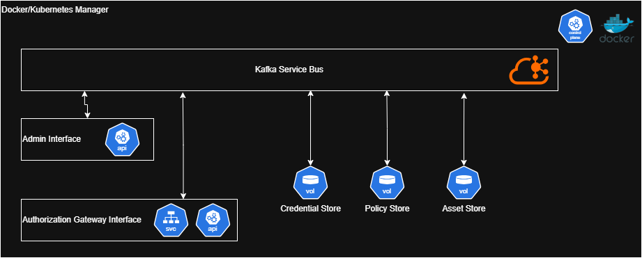

# Architecture Plan

In accordance with best practices for modern cloud applications, the concept of encapsulation and uncoupling are followed by attempting to create stateless microservices. To allow for fast and efficient messaging between components **apache kafka** is used as a generic widely supported message broker.

## Component Services Plan

In accordance with the microservice paradigm, responsibilities of packages are split into smaller runners or images wherever reasonable/possible. To facilitate the microservices, docker containerization is used to run and docker-compose to orchestrate containers during development; this could easily be replaced with kubernetes and similar container management tools in a production deployment. The following are the planned services/microservices:
- Apache Kafka
- Resource Service/Database
- User/Role Service/Database
- Policy Database
- Administrative Interface
- Access Gateway Interface

#### Apache Kafka

Kafka is used as a message broker to decouple components in a typical pub-sub nature compatible with all major cloud service busses, while also being self hostable for clients who would deploy this solution to their own self managed hardware.

#### Databases

To provide the strongest consistency while accounting for failures and distribution in a large multinational or cross continent deployment, **TiDB* is chosen for its use of the *RAFT* consensus algorithm by default while providing rapid propagation of changes needed for just in time rule/credential changes. *One of the worst experiences dealt with by traditional credential management and authority systems for users and admins is the propagation time of changes.* TiDB also connects using the traditional MySQL JDBC connectors making it familiar for team members and compatible with kafka connectors.

##### User/Role Database/Service

This component is responsible for the authentication of users/roles and the storage of their credentials.

##### Policy Database

This component is responsible for the storage of the various access and authorization policies. It maps the user authorizations to the assets agnostically (it does not know about the users/roles or the assets, just the rules).

##### Asset Service/Database

This component is responsible for the store and management of assets flags/access parameters.

#### Administrative Interface

Provides a restricted entrypoint for changes and management of authorization properties.

#### Access Gateway Service

Provides an API or gateway for applications/users to request and retrieve authorization to restricted assets. This is what would integrate with other applications and serve as the primary entry point to the system.

### Visual Overview
